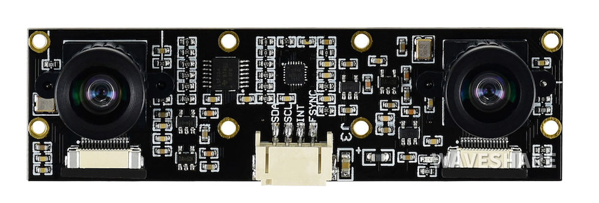

# Android双目摄像头/非标准人脸搜索测试工具
该Demo 参考github 项目BinocularCamera,同时演示自管理双目摄像头如何快速接入人脸搜索SDK
目前RK 3X88 测试每次搜索反应时间大约为2xx 毫秒，加入活体检测时间也会控制在300MS内

也可以作为部分自己定制的开发板摄像头非CameraX 标准摄像头希望使用老的Camera1 API进行管理画面，
画面数据再送入SDK 进行检测，用户也可以升级为Camera2 API

1. 支持双目(RGB,IR)摄像头同时预览
2. 可作为测试工具检测双目摄像头是否正常打开
3. 接入FaceSearch SDK 进行人脸搜索
4. 可以自定义摄像头方向，旋转画面，和画面比例等

# 接入SDK 步骤和简要说明

1. gradle 引入 implementation 'io.github.anylifezlb:FaceSearchSDK:1.xxx' 参考主工程最新版本
2. 调整项目compileSdk 33 和Kotlin 支持 （人脸管理后期会全部用Java 重构）
3. 支持自己管理摄像头仅仅使用SDK API 进行搜索
   //1.在摄像头回调预览中循环调用runSearch()方法
   //自行保证Bitmap 的方向角度正确无旋转，清晰度。runSearch必须在子线程运行
   FaceSearchEngine.Companion.getInstance().runSearch(realTimeFaceBmp);
4. 各种搜索参数的初始化
   // 2.各种参数的初始化设置
   SearchProcessBuilder faceProcessBuilder = new SearchProcessBuilder.Builder(getApplication())
5. 初始化引擎开始搜索
   //3.初始化引擎
   FaceSearchEngine.Companion.getInstance().initSearchParams(faceProcessBuilder);
6. 所有的人脸都必须通过SDK 的API 插入到人脸管理目录，而不是File 文件放入到目录就行，SDK API 还会提取人脸特征操作
7. Demo 中有Assert 有250 张测试人脸；你可以在人脸管理页面中右上角通过自拍添加一张个人清晰人脸照进行测试验证
8. 更多请查阅精简库 https://github.com/AnyLifeZLB/FaceSearchSDK_Android
9. 了解Demo 后还有问题需要定制解决请联系微信 18707611416 或邮件anylife.zlb@gmail.com
10. 双目摄像头活体检测需要定制，Demo 暂时不接入